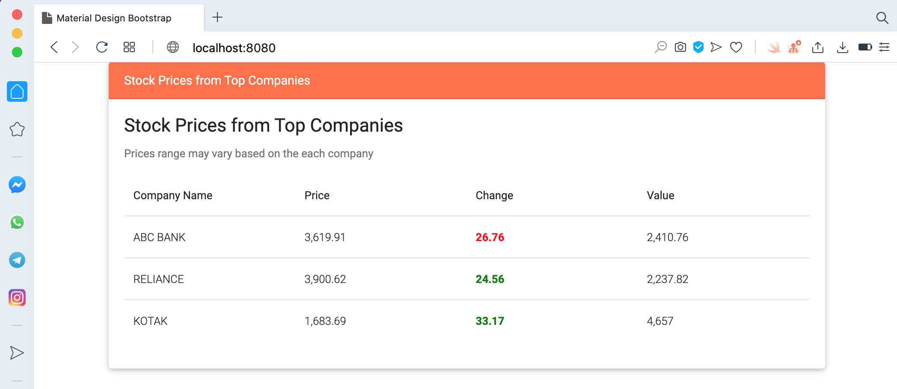

# springboot-sse-demo
### Things todo list:
1. Clone this repository: `git clone https://github.com/hendisantika/springboot-sse-demo.git`
2. Go inside the folder: `cd springboot-sse-demo`
3. Run the application: `gradle clean bootRun --info`
4. Navigate to your favorite browser: http://localhost:8080

### Screen shot

Index Page

